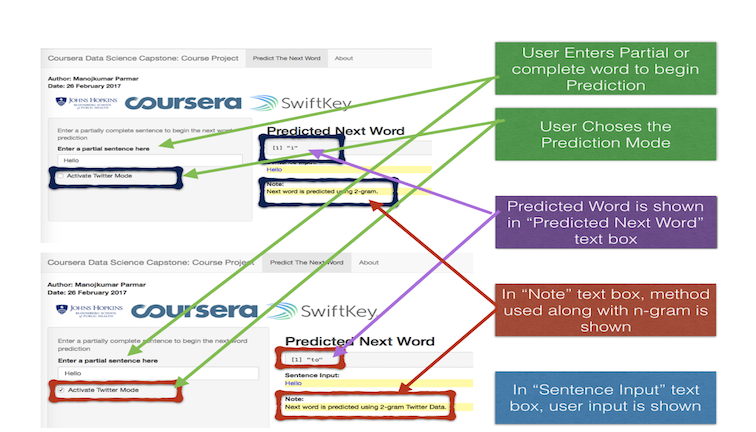

```{r setup, include=FALSE}
knitr::opts_chunk$set(echo = FALSE)
```

## Introduction | Motivation & Reference 


<div class="blue"> 

- This presentation is created as part of the requirement for the **Coursera Data Science Capstone Course**.
</div>

- The goal of the project is to build a predictive text model combined with a shiny app UI that will predict the next word as the user types a sentence similar to the way most smart phone keyboards are implemented today using the technology of Swiftkey.

<div class="green"> 
**Refences**

+ Prediction model is build based on previous **[milestone report](https://rpubs.com/parmarmanojkumar/cdscmr)**
+ Shiny App **[Link](https://parmarmanojkumar.shinyapps.io/WordPrediction/)** and Github Repo **[Link](https://github.com/parmarmanojkumar/DataScience_CapStone)**
<div>

## Data Processing | Getting & Cleaning Data
<div class="blue"> 
Before building the word prediction algorithm, data are first processed and cleaned as steps below:
</div>
<div class="green">
- A subset of the original data was sampled from the three sources (*blogs,twitter and news*) which is then merged into one set and *only twitter* data in to another set
- Next, data cleaning is done by conversion to lowercase, strip white space, and removing punctuation and numbers.
- The corresponding n-grams are then created (Quadgram,Trigram and Bigram).
- Next, the term-count tables are extracted from the N-Grams and sorted according to the frequency in descending order.
- Lastly, the n-gram objects are saved as R-Compressed files (.RData files) for **twitter only** and **combined data**.
</div>

## Word Prediction Model | N-gram with Back Off Algorithm {.smaller .columns-2 }

The prediction model for next word is based on the Katz Back-off algorithm. Explanation of the next word prediction flow is as below:

<div class="blue">
- Compressed data sets containing descending frequency sorted n-grams are first loaded for twitter and combined set.
- In case twitter like pattern is needed, user can select twitter mode where only frequncy sorted n-gram for twitter is used for prediction.
- User input words are cleaned in the similar way as before prior to prediction of the next word.
- For prediction of the next word, Quadgram is first used (first three words of Quadgram are the last three words of the user provided sentence).
</div>
<div class="blue">
- If no Quadgram is found, back off to Trigram (first two words of Trigram are the last two words of the sentence).
- If no Trigram is found, back off to Bigram (first word of Bigram is the last word of the sentence)
- If no Bigram is found, back off to the most common word with highest frequency 'the' is returned.
</div>

## Shiny Application | With & Without Twitter Mode {.smaller}


Thank You!!
